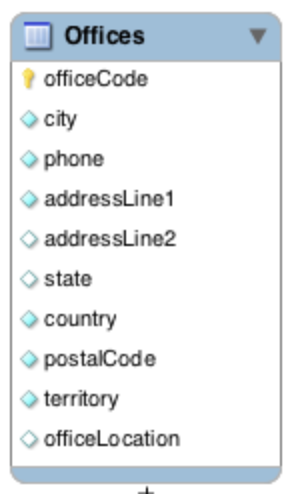
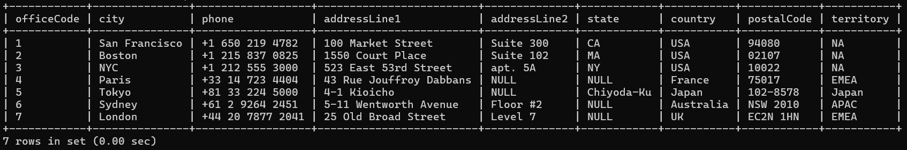

# Offices 



The offices table can be created as follows :

```sql
create table offices (
  officeCode varchar(10) not null,
  city varchar(50) not null,
  phone varchar(50) not null,
  addressLine1 varchar(50) not null,
  addressLine2 varchar(50),
  state varchar(50),
  country varchar(50) not null,
  postalCode varchar(15) not null,
  territory varchar(10) not null,
  primary key (officeCode)
);
```

## Primary Key

**Primary Key** : we've included a `primary key` constraint on the `officeCode` column. 

- The `primary key` constraint uniquely identifies each record in a table.
- Primary keys must contain UNIQUE values, and cannot contain `null` values.
- A table can have only **ONE** primary key constraint; and in the table, this primary key can consist of single or multiple columns (fields).

We can check that the table is created using `show tables;` and view information about it using `describe offices;`

```sql
show tables;
```

Output :
```
+--------------------+
| Tables_in_learning |
+--------------------+
| offices            |
+--------------------+
1 row in set (0.00 sec)
```

```sql
describe offices;
```

Output :
```
+--------------+-------------+------+-----+---------+-------+
| Field        | Type        | Null | Key | Default | Extra |
+--------------+-------------+------+-----+---------+-------+
| officeCode   | varchar(10) | NO   | PRI | NULL    |       |
| city         | varchar(50) | NO   |     | NULL    |       |
| phone        | varchar(50) | NO   |     | NULL    |       |
| addressLine1 | varchar(50) | NO   |     | NULL    |       |
| addressLine2 | varchar(50) | YES  |     | NULL    |       |
| state        | varchar(50) | YES  |     | NULL    |       |
| country      | varchar(50) | NO   |     | NULL    |       |
| postalCode   | varchar(15) | NO   |     | NULL    |       |
| territory    | varchar(10) | NO   |     | NULL    |       |
+--------------+-------------+------+-----+---------+-------+
9 rows in set (0.00 sec)
```

## Inserting Data

**Inserting Data** : We can insert some rows into the table using the `insert into` statement.

```sql
insert into offices 
(officeCode,city,phone,addressLine1,addressLine2,state,country,postalCode,territory) values 
('1','San Francisco','+1 650 219 4782','100 Market Street','Suite 300','CA','USA','94080','NA'),
('2','Boston','+1 215 837 0825','1550 Court Place','Suite 102','MA','USA','02107','NA'),
('3','NYC','+1 212 555 3000','523 East 53rd Street','apt. 5A','NY','USA','10022','NA'),
('4','Paris','+33 14 723 4404','43 Rue Jouffroy Dabbans',NULL,NULL,'France','75017','EMEA'),
('5','Tokyo','+81 33 224 5000','4-1 Kioicho',NULL,'Chiyoda-Ku','Japan','102-8578','Japan'),
('6','Sydney','+61 2 9264 2451','5-11 Wentworth Avenue','Floor #2',NULL,'Australia','NSW 2010','APAC'),
('7','London','+44 20 7877 2041','25 Old Broad Street','Level 7',NULL,'UK','EC2N 1HN','EMEA');
```

The `insert` statement has the following general syntax :

```sql
insert into table_name(column_1, column_2,...) values (value1_1,value1_2,...), (value2_1,value2_2,...), ...;
```

If you're inserting values for all the columns, you can skip the column names :

```sql
insert into table_name values (value1_1, value1_2, ...), (value2_1,value2_2,...), ...;
```

## Viewing Data

**Viewing Data** : The simplest way to view data from the table is using the `select` statement. It has the following syntax :

```sql
select column1, column2, ... from table_name;
```

You can also view data from all columns using

```sql
select * from offices;
```

Output :
